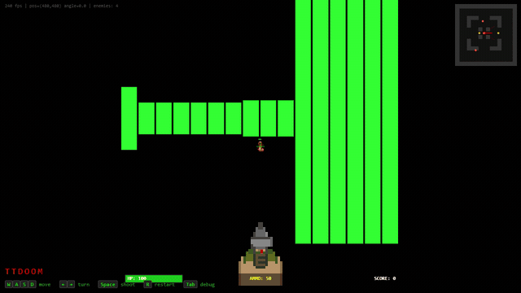
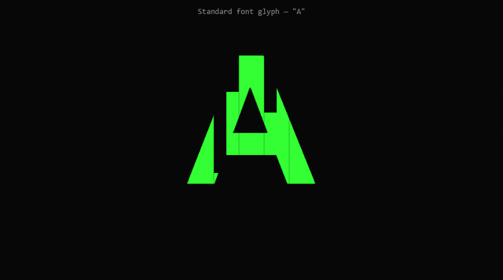
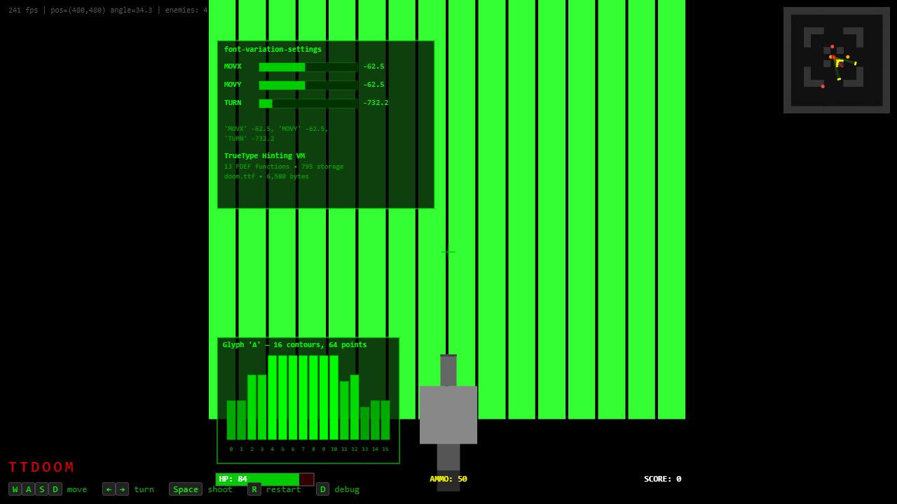

# TTF-DOOM

A DOOM-style raycaster that runs inside a TrueType font's hinting program.

<p align="center">
  
</p>

<p align="center">
  <a href="https://4rh1t3ct0r7.github.io/ttf-doom/">
    
  </a>
</p>

## What is this?

TrueType fonts have a built-in virtual machine for grid-fitting glyphs. It's got a stack, storage slots, arithmetic, conditionals, function calls - and it turns out it's Turing-complete. I wanted to see if I could get it to render 3D graphics.

The font file contains a DDA raycasting engine written in TrueType bytecode. The glyph "A" has 16 vertical bar contours, and the hinting program raycasts against a 16x16 tile map and repositions those bars using SCFS instructions to form a 3D perspective view. The whole thing is 6.5 KB.

JS handles movement, enemies, and shooting, then passes coordinates to the font through `font-variation-settings`. The font does the raycasting and wall rendering. Canvas overlay draws enemies, weapon, and HUD on top.

## How it works

I wrote a small compiler that takes a custom DSL and outputs TrueType hinting assembly. The DSL looks like a stripped-down C:

```
func raycast(col: int) -> int:
    var ra: int = player_angle + col * 3 - FOV_HALF
    var dx: int = get_cos(ra)
    var dy: int = get_sin(ra)
    ...
```

This compiles to TT bytecode - `FDEF`, `CALL`, `RS`, `WS`, `SCFS`, etc. - and gets injected into a `.ttf` file along with sin/cos lookup tables and the map data. The compiler handles variable allocation (everything goes into TT storage slots), function definitions (FDEF/ENDF), and a few other things like fixed-point math.

The pipeline: `doom.doom` -> lexer -> parser -> codegen -> `doom.ttf`

<p align="center">
  
</p>

## TrueType arithmetic is insane

`MUL` does `(a*b)/64`. Not `a*b`. Everything is F26Dot6 fixed-point internally. So `1 * 4 = 0`. I lost probably two days to this before I found a workaround: `DIV(a, 1)` returns `a * 64` (DIV is equally broken), then `MUL(a*64, b)` = `(a*64*b)/64` = `a*b`.

There's no WHILE instruction either. Loops compile to recursive FDEFs, and FreeType caps the call stack at ~64 frames. 16 columns x 14 ray steps barely fits.

`return` inside a recursive-while doesn't exit. It pushes a value and keeps going. Everything had to be rewritten with hit flags.

SCFS takes F26Dot6 pixel coordinates, not font units - took me a while to figure out why every bar was a tiny speck. Chrome caches hinted glyphs and sometimes skips re-hinting when axes change - fixed with per-frame jitter. `SVTCA[0]` selects Y, `[1]` selects X.

## Architecture

The font just renders walls. JS does everything else.

Player position and angle go into three font variation axes (`MOVX`, `MOVY`, `TURN`). JS stuffs coordinates into `font-variation-settings` every frame. Browser re-hints the glyph. Shape changes.

Press Tab in the demo to see what's going on under the hood:

<p align="center">
  
</p>

## Try it

```
git clone https://github.com/4RH1T3CT0R7/ttf-doom.git
cd ttf-doom
pip install fonttools freetype-py pygame pytest
python game/build.py
python -m http.server 8765
```

Open `http://localhost:8765/hosts/browser/index.html` in Chrome or Edge. WASD to move, arrows to turn, Space to shoot. Press Tab for a debug overlay showing the font variation axes in real-time.

## Project layout

```
compiler/       DSL -> TrueType assembly (lexer, parser, codegen)
fontgen/        font builder, glyph generator, sin/cos tables
game/           raycaster source (doom.doom) and build script
hosts/browser/  browser demo
hosts/python/   pygame host (for development)
tests/          451 tests
doom.ttf        the playable font (6,580 bytes)
```

## llama.ttf vs this

[llama.ttf](https://github.com/fuglede/llama.ttf) also runs computation in a font, but it uses HarfBuzz's WASM shaper - basically a WebAssembly runtime bolted onto font shaping. TTF-DOOM uses the actual TrueType hinting bytecode that Apple shipped in 1991 for grid-fitting glyphs. Different VM entirely.

## License

[Apache 2.0](LICENSE)
